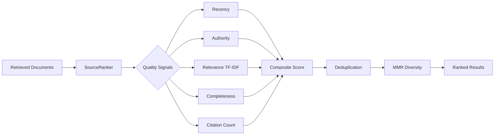

# SourceRank

[](https://github.com/MukundaKatta/SourceRank/actions/workflows/ci.yml)
[](https://www.python.org/downloads/)
[](LICENSE)

**Citation and source quality ranker for RAG systems** — score documents by relevance, authority, recency, and diversity. Designed to sit between your retrieval step and your LLM to surface the highest-quality sources.



## Quickstart

### Installation

```bash
pip install -e .
```

### Python API

```python
from sourcerank import SourceRanker, SourceDocument, RankerConfig

ranker = SourceRanker()

sources = [
    SourceDocument(
        content="Retrieval-Augmented Generation combines retrieval with generation for grounded answers.",
        url="https://arxiv.org/abs/2005.11401",
        title="RAG Paper",
        published_date="2025-10-01",
        citation_count=120,
    ),
    SourceDocument(
        content="Some thoughts on AI from a random blog post without much detail.",
        url="https://random-blog.com/ai-thoughts",
        title="AI Thoughts",
        published_date="2021-03-15",
        citation_count=0,
    ),
]

results = ranker.rank(query="retrieval augmented generation", sources=sources, top_k=5)

for r in results:
    print(f"{r.composite_score:.4f}  {r.document.title}")
    print(f"  relevance={r.signals.relevance:.2f}  authority={r.signals.authority:.2f}")
```

### CLI

```bash
# Rank documents from a directory of .txt/.json files
sourcerank rank --query "retrieval augmented generation" --sources docs/

# With options
sourcerank rank -q "RAG quality" -s docs/ --top-k 5 --no-dedup
```

## Quality Signals

| Signal         | What it measures                                         | Default Weight |
|----------------|----------------------------------------------------------|----------------|
| Relevance      | TF-IDF cosine similarity to the query                    | 0.30           |
| Authority      | Domain reputation (.gov/.edu score higher)               | 0.25           |
| Recency        | How recent the source is (newer = better)                | 0.20           |
| Citation Count | Log-scaled citation count                                | 0.15           |
| Completeness   | Document length relative to ideal length                 | 0.10           |

## Features

- **Configurable weights** — tune signal importance via `RankerConfig`
- **URL-based authority** — `.gov` and `.edu` domains score higher than `.com`
- **Deduplication** — detect and remove near-duplicate sources (Jaccard similarity)
- **Diverse top-k** — MMR-like selection balances relevance with diversity
- **Rich CLI** — pretty-printed ranking tables via Rich

## Configuration

```python
from sourcerank import SourceRanker, RankerConfig
from sourcerank.config import SignalWeights

config = RankerConfig(
    weights=SignalWeights(
        recency=0.1,
        authority=0.4,
        relevance=0.3,
        completeness=0.1,
        citation_count=0.1,
    ),
)

ranker = SourceRanker(config)
```

## Development

```bash
# Install with dev dependencies
make dev

# Run tests
make test

# Lint
make lint
```

---

Built by [Officethree Technologies](https://officethree.com) | Made with ❤️ and AI
