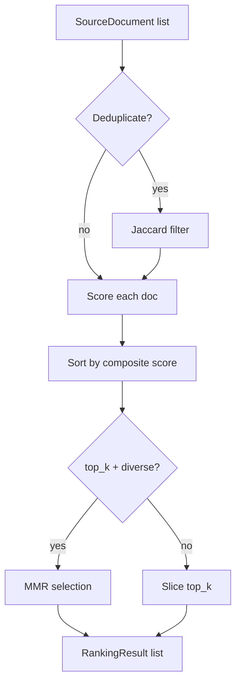

# Architecture

## Overview

SourceRank is a citation and source quality ranker designed to sit between the retrieval step and the LLM in a RAG pipeline. It scores and ranks source documents using multiple quality signals, deduplicates near-identical sources, and selects a diverse top-k set.

## Module Structure

```
src/sourcerank/
  __init__.py       Public API exports
  config.py         Pydantic configuration models (weights, thresholds)
  core.py           SourceRanker engine, data models (SourceDocument, QualitySignals, RankingResult)
  utils.py          URL parsing, TF-IDF similarity, Jaccard similarity, date helpers
  __main__.py       Typer CLI entry-point
```

## Ranking Pipeline

```
Input Sources
    |
    v
[Deduplication] -- Jaccard similarity threshold (default 0.85)
    |
    v
[Signal Scoring] -- Per-document, per-signal scores (0..1)
    |  recency:       linear decay over max_document_age_days
    |  authority:     TLD-based domain reputation lookup
    |  relevance:     TF-IDF cosine similarity to query
    |  completeness:  document length vs ideal length
    |  citation_count: log-scaled citation count
    |
    v
[Composite Score] -- Weighted sum of normalized signal scores
    |
    v
[Top-k Selection] -- Maximal Marginal Relevance (MMR) for diversity
    |
    v
Ranked Results
```

## Key Design Decisions

1. **No external ML models** -- All scoring is deterministic and explainable. TF-IDF is computed inline without a pre-built index.

2. **Configurable weights** -- Every signal weight is tunable via `RankerConfig`. Weights are auto-normalized to sum to 1.0.

3. **MMR diversity** -- The `lambda_param` trades off between pure relevance (1.0) and pure diversity (0.0). Default is 0.7.

4. **Deduplication before scoring** -- Near-duplicates are removed before scoring to avoid wasting compute.

## Data Flow


